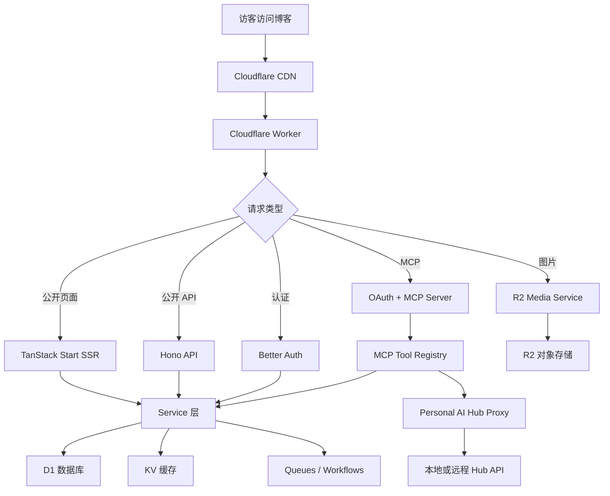

# Flare Stack Blog

基于 Cloudflare Workers 的全栈博客 CMS。当前版本在原 Flare Stack Blog 的基础上，增加了更完整的后台管理、主题系统、MCP Server、Personal AI Hub 接入、长文维护规则、导入导出、版本历史、评论审核、统计与缓存维护能力。

本项目适合用来搭建个人技术博客，也适合把博客变成一个可由 AI 客户端调用的内容管理中心。

> 本项目借鉴了原作者的 Flare Stack Blog 项目和部署思路。完整图文部署流程可参考 [Flare Stack Blog 部署教程](https://blog.dukda.com/post/flare-stack-blog%E9%83%A8%E7%BD%B2%E6%95%99%E7%A8%8B)。本文档会按当前仓库的新功能和配置方式补充说明。

## 项目定位

Flare Stack Blog 是一个运行在 Cloudflare 生态上的现代博客系统。前端使用 React 19 和 TanStack Start，后端运行在 Cloudflare Workers，数据和文件分别落在 D1、R2、KV、Queues、Workflows、Durable Objects 等 Serverless 资源中。

当前仓库重点强化了三件事：

- 博客后台：文章、媒体、标签、评论、友情链接、配置、缓存和统计都能在后台维护。
- AI 工作流：通过 MCP Server 和 Personal AI Hub，把博客内容管理、知识库查询和 Agent Chat 暴露给 AI 客户端。
- 长期内容维护：为 `AI 技术新闻` 和 `无线感知前沿` 两篇长期维护文章增加专门编辑规则。

## 功能总览

### 内容管理

- 文章草稿、发布、定时发布和下架。
- TipTap 富文本编辑器，支持代码块、表格、图片、数学公式和目录。
- 自动快照和版本历史，支持查看历史版本和差异。
- 标签管理、文章搜索、相关文章、RSS、Atom、JSON Feed、Sitemap 和 Robots。
- Markdown 导入导出，支持 Frontmatter、图片重写和压缩包下载。

### 媒体与主题

- R2 媒体库，支持上传、预览、选择和删除。
- 图片通过 `/images/*` 统一服务，并配合缓存策略。
- 默认主题和 `fuwari` 主题。
- 主题契约将页面、布局和业务逻辑拆开，便于扩展新主题。
- 后台设置页可维护站点标题、描述、社交链接、图标、主题背景等配置。

### 用户、评论与通知

- Better Auth 认证，支持邮箱密码和 GitHub OAuth。
- 管理员由 `ADMIN_EMAIL` 自动识别。
- 评论支持嵌套回复、审核状态和后台管理。
- 邮件通知和 Webhook 通知。
- 友情链接提交、审核和结果通知。
- Turnstile 人机验证和 Durable Objects 限流。

### MCP 与 AI

- 内置 MCP Server，AI 客户端可通过 OAuth 授权调用博客工具。
- MCP 工具覆盖文章、评论、标签、媒体、友情链接、搜索、统计和 Personal AI Hub。
- MCP Prompt 支持从 brief 写文章、发布流程、评论审核和博客统计复盘。
- Personal AI Hub 后台页支持查询本地 LLM Wiki。
- Agent Chat 支持先检索本地知识库，再把上下文交给 Agent Runtime。
- Workers AI 可用于评论审核等 AI 辅助场景。

### 长期维护内容

- `AI_TECH_NEWS_RULES.md` 定义 `AI 技术新闻` 的来源、标签、格式和更新规则。
- `SENSING_FRONTIER_RULES.md` 定义 `无线感知前沿` 的论文来源、标签、重点方向和更新规则。
- 这些规则用于维护长期文章，避免新闻堆砌和风格漂移。

## 技术栈

| 层级 | 技术 |
| --- | --- |
| 前端 | React 19、TanStack Start、TanStack Router、TanStack Query、Tailwind CSS 4 |
| 后端 | Cloudflare Workers、Hono、TanStack Server Functions |
| 数据 | Cloudflare D1、Drizzle ORM、drizzle-zod |
| 存储 | Cloudflare R2、KV |
| 异步任务 | Cloudflare Workflows、Queues |
| 边缘能力 | Durable Objects、Workers AI、Cloudflare CDN |
| 认证 | Better Auth、GitHub OAuth、Workers OAuth Provider |
| 编辑器 | TipTap、Shiki、KaTeX |
| 搜索 | Orama |
| 国际化 | Paraglide JS |
| 测试 | Vitest、Cloudflare Workers pool |
| 质量工具 | Biome、TypeScript |

## 工作流程



## 目录结构

```text
.
├── src/
│   ├── routes/                  # TanStack 文件路由
│   ├── features/                # 功能模块
│   │   ├── posts/               # 文章、版本、发布工作流
│   │   ├── comments/            # 评论和审核
│   │   ├── media/               # R2 媒体库
│   │   ├── mcp/                 # MCP Server、工具和提示词
│   │   ├── personal-ai-hub/     # Personal AI Hub 后台代理
│   │   ├── import-export/       # Markdown 导入导出
│   │   ├── theme/               # 主题契约和主题实现
│   │   └── ...
│   ├── lib/                     # DB、Auth、Hono、Env、中间件、错误处理
│   ├── components/              # 通用 UI 与编辑器组件
│   └── styles/                  # 全局样式和后台样式
├── migrations/                  # D1 迁移
├── scripts/                     # 构建、迁移、MCP 登录等脚本
├── tests/                       # 测试辅助
├── docs/                        # 主题、错误处理、英文文档和截图
├── messages/                    # 国际化文案
├── .github/workflows/           # CI 与部署工作流
├── .env.example                 # 客户端和 Drizzle 远程操作变量示例
├── .dev.vars.example            # Wrangler 运行时变量示例
└── wrangler.example.jsonc       # Cloudflare 资源绑定模板
```

## 本地开发

### 前置要求

- Bun 1.3 或更高版本。
- Cloudflare 账号。
- GitHub OAuth App。
- 已创建或准备创建 D1、R2、KV、Queues 等 Cloudflare 资源。

### 安装依赖

```bash
bun install
```

### 准备本地配置

```bash
cp .env.example .env
cp .dev.vars.example .dev.vars
cp wrangler.example.jsonc wrangler.jsonc
```

然后编辑：

- `.env`：客户端构建变量，以及 Drizzle 远程数据库操作变量。
- `.dev.vars`：Worker 运行时变量。
- `wrangler.jsonc`：D1、R2、KV、Queues、Workflows、Durable Objects 和路由绑定。

真实密钥不要提交。`.env`、`.dev.vars`、`wrangler.jsonc` 已在 `.gitignore` 中排除。

### 启动开发服务

```bash
bun dev
```

本地访问：

```text
http://localhost:3000
```

### 登录后台

后台路径：

```text
http://localhost:3000/admin
```

开发环境推荐先用邮箱密码注册：

1. `.dev.vars` 中设置 `ADMIN_EMAIL`。
2. 使用该邮箱注册。
3. 开发环境的验证邮件链接会打印在终端日志中。
4. 访问验证链接后，该账号会获得管理员权限。

如果使用 GitHub OAuth，本地 OAuth App 配置如下：

```text
Homepage URL: http://localhost:3000
Authorization callback URL: http://localhost:3000/api/auth/callback/github
```

## 环境变量

本项目有两类环境变量。

| 文件 | 用途 | 是否提交 |
| --- | --- | --- |
| `.env.example` | 客户端变量和 Drizzle 远程操作变量示例 | 提交 |
| `.env` | 本地真实客户端变量 | 不提交 |
| `.dev.vars.example` | Worker 运行时变量示例 | 提交 |
| `.dev.vars` | 本地真实运行时变量 | 不提交 |
| `wrangler.example.jsonc` | Cloudflare 绑定模板 | 提交 |
| `wrangler.jsonc` | 本地真实 Cloudflare 绑定 | 不提交 |

### `.env` 变量

| 变量 | 必填 | 说明 |
| --- | --- | --- |
| `CLOUDFLARE_ACCOUNT_ID` | 本地远程 DB 操作需要 | Cloudflare Account ID |
| `CLOUDFLARE_DATABASE_ID` | 本地远程 DB 操作需要 | D1 Database ID |
| `CLOUDFLARE_D1_TOKEN` | 本地远程 DB 操作需要 | D1 操作 Token |
| `VITE_TURNSTILE_SITE_KEY` | 可选 | Turnstile Site Key，会进入客户端包 |
| `VITE_UMAMI_WEBSITE_ID` | 可选 | Umami Website ID，会进入客户端包 |

### `.dev.vars` 变量

| 变量 | 必填 | 说明 |
| --- | --- | --- |
| `ENVIRONMENT` | 是 | `dev`、`prod` 或 `test` |
| `BETTER_AUTH_SECRET` | 是 | 会话密钥，建议用 `openssl rand -hex 32` 生成 |
| `BETTER_AUTH_URL` | 是 | 本地为 `http://localhost:3000`，生产为站点 URL |
| `ADMIN_EMAIL` | 是 | 管理员邮箱 |
| `GITHUB_CLIENT_ID` | 是 | GitHub OAuth Client ID |
| `GITHUB_CLIENT_SECRET` | 是 | GitHub OAuth Client Secret |
| `CLOUDFLARE_ZONE_ID` | 是 | Cloudflare Zone ID |
| `CLOUDFLARE_PURGE_API_TOKEN` | 是 | CDN 清缓存 Token |
| `DOMAIN` | 是 | 生产域名，如 `blog.example.com` |
| `CDN_DOMAIN` | 可选 | 独立 CDN 域名 |
| `PAGEVIEW_SALT` | 推荐 | 浏览量匿名访客哈希 salt |
| `TURNSTILE_SECRET_KEY` | 可选 | Turnstile Secret Key |
| `GITHUB_TOKEN` | 可选 | 版本检查用，避免 GitHub API 限流 |
| `UMAMI_SRC` | 可选 | Umami 代理源，如 `https://cloud.umami.is` |
| `VITE_UMAMI_WEBSITE_ID` | 可选 | Worker 运行时也可读取的 Umami ID |
| `PERSONAL_AI_HUB_API_URL` | 可选 | Personal AI Hub API 地址 |
| `PERSONAL_AI_HUB_API_TOKEN` | 可选 | Personal AI Hub API Token |

### 变量安全

- 不要提交 `.env`、`.dev.vars`、`wrangler.jsonc`、`.mcp.json`、`mcp-tokens.json`。
- `VITE_` 变量会进入前端构建产物，不要放服务端密钥。
- `PERSONAL_AI_HUB_API_TOKEN`、`GITHUB_CLIENT_SECRET`、`BETTER_AUTH_SECRET` 只能放在 Worker Secrets 或 `.dev.vars`。

## Cloudflare 资源准备

你需要提前准备这些资源：

| 资源 | 用途 | 绑定名 |
| --- | --- | --- |
| Workers | 承载全栈应用 | `main` 指向 `src/server.ts` |
| D1 | 文章、评论、用户、配置等数据库 | `DB` |
| R2 | 图片和媒体文件 | `R2` |
| KV | 缓存与 OAuth 辅助存储 | `KV`、`OAUTH_KV` |
| Queues | 邮件、Webhook、浏览量等异步任务 | `QUEUE` |
| Workflows | 文章处理、快照、评论审核、导入导出 | 多个 workflow binding |
| Durable Objects | 限流和密码哈希 | `RATE_LIMITER`、`PASSWORD_HASHER` |
| Workers AI | AI 审核等能力 | `AI` |

`wrangler.example.jsonc` 中已经列出所有 binding。复制为 `wrangler.jsonc` 后，填入自己的资源 ID 和域名。

## 部署方式

推荐优先使用 GitHub Actions 自动部署。Cloudflare Dashboard 连接仓库也可用，但缓存清理和变量管理需要手动处理。

### 方式一：GitHub Actions 自动部署

1. 把代码推送到 GitHub 仓库。
2. 在仓库的 `Settings -> Secrets and variables -> Actions` 中配置变量。
3. 启用 Actions。
4. 推送 `main` 分支或手动运行 `deploy to cloudflare workers` 工作流。

#### GitHub Actions Secrets

| Secret | 说明 |
| --- | --- |
| `CLOUDFLARE_API_TOKEN` | 部署 Worker、操作 D1 和资源的 Token |
| `CLOUDFLARE_ACCOUNT_ID` | Cloudflare Account ID |
| `D1_DATABASE_ID` | D1 Database ID |
| `KV_NAMESPACE_ID` | KV Namespace ID |
| `BUCKET_NAME` | R2 Bucket 名称 |
| `BETTER_AUTH_SECRET` | Better Auth 会话密钥 |
| `BETTER_AUTH_URL` | 生产站点 URL |
| `ADMIN_EMAIL` | 管理员邮箱 |
| `GH_CLIENT_ID` | GitHub OAuth Client ID |
| `GH_CLIENT_SECRET` | GitHub OAuth Client Secret |
| `CLOUDFLARE_ZONE_ID` | Cloudflare Zone ID |
| `CLOUDFLARE_PURGE_API_TOKEN` | CDN 清缓存 Token |
| `DOMAIN` | 博客域名 |
| `CDN_DOMAIN` | 可选，独立 CDN 域名 |
| `UMAMI_SRC` | 可选，Umami 代理源 |
| `PAGEVIEW_SALT` | 推荐，浏览量匿名 salt |
| `TURNSTILE_SECRET_KEY` | 可选，Turnstile Secret Key |
| `GH_TOKEN` | 可选，版本检查用 GitHub Token |
| `PERSONAL_AI_HUB_API_URL` | 可选，Personal AI Hub API 地址 |
| `PERSONAL_AI_HUB_API_TOKEN` | 可选，Personal AI Hub API Token |

#### GitHub Actions Variables

| Variable | 说明 |
| --- | --- |
| `VITE_UMAMI_WEBSITE_ID` | 可选，Umami Website ID |
| `VITE_TURNSTILE_SITE_KEY` | 可选，Turnstile Site Key |
| `THEME` | 可选，主题名，如 `default` 或 `fuwari` |
| `ROUTE` | 可选，设为 `1` 时使用 Cloudflare routes 模式 |
| `ZONE_NAME` | 可选，`ROUTE=1` 且无法从 `DOMAIN` 推导时使用 |

部署工作流会执行：

```bash
bun ci
bun run wrangler:prepare
bunx wrangler secret bulk secrets.json
bun run build
bun run deploy
```

`wrangler:prepare` 会根据 `DOMAIN`、`ROUTE`、`D1_DATABASE_ID`、`KV_NAMESPACE_ID` 和 `BUCKET_NAME` 生成真实 `wrangler.jsonc`。

### 方式二：Cloudflare Dashboard 连接仓库

1. 在 Cloudflare Dashboard 创建 Worker 并连接 GitHub 仓库。
2. Framework preset 选择 `None`。
3. Build command 填：

```bash
bun run build
```

4. Deploy command 填：

```bash
bun run deploy
```

5. 构建变量中配置 `BUN_VERSION` 和所有 `VITE_` 变量。
6. Worker 的 Variables and Secrets 中配置运行时变量。
7. 手动维护 `wrangler.jsonc` 或在构建流程中先生成它。

使用 Dashboard 方式时，部署后不会自动执行仓库中的 CDN 清缓存步骤。需要在后台设置页或 Cloudflare Dashboard 手动清缓存。

## 数据库迁移

生成迁移：

```bash
bun run db:generate
```

本地迁移：

```bash
bun run db:migrate:local
```

远程安全迁移：

```bash
bun run db:migrate
```

直接使用 Wrangler 远程迁移：

```bash
bun run db:migrate:unsafe
```

默认部署脚本会在 `bun run deploy` 前执行 `bun db:migrate`。

## MCP Server

本项目内置 MCP Server，用于把博客能力暴露给 AI 客户端。

### 服务入口

生产环境 MCP 地址通常是：

```text
https://你的域名/mcp
```

OAuth 相关路径：

```text
/oauth/register
/oauth/consent
/oauth/token
```

### MCP 工具能力

- `posts_*`：创建草稿、更新文章、读取文章、删除文章、设置可见性。
- `tags_*`：创建、更新、删除、列出标签，给文章设置标签。
- `comments_*`：列出评论、设置审核状态、删除评论。
- `media_*`：列出媒体、删除媒体、查看使用情况。
- `friend_links_*`：创建、更新、删除、列出友情链接。
- `search_posts`：搜索文章。
- `analytics_overview`：查看博客统计概览。
- `wiki_query`、`wiki_sources_list`、`wiki_status`：通过 Personal AI Hub 查询本地知识库。

### 本地 MCP 登录脚本

脚本位置：

```text
scripts/mcp-login.ts
scripts/mcp-login-simple.mjs
scripts/mcp-refresh-auto.mjs
```

首次登录会启动本地回调服务并完成 OAuth 授权。脚本会把 token 保存到 `mcp-tokens.json`，并可能写入 `.mcp.json`。

这两个文件包含真实凭据，已经加入 `.gitignore`，不要上传到 GitHub。

## Personal AI Hub

后台有两个页面：

```text
/admin/personal-ai-hub
/admin/personal-ai-hub/agent-chat
```

`/admin/personal-ai-hub` 用来检查 Hub 状态和查询本地 LLM Wiki。`/admin/personal-ai-hub/agent-chat` 用来管理 Agent 会话，并把检索结果交给 Agent Runtime。

需要配置：

```text
PERSONAL_AI_HUB_API_URL=https://hub-api.example.com
PERSONAL_AI_HUB_API_TOKEN=your-token
```

本地开发可指向：

```text
PERSONAL_AI_HUB_API_URL=http://127.0.0.1:8000
```

生产环境建议通过 Cloudflare Tunnel 暴露本地 Hub API，并使用 Token 保护。

## 长期文章维护

当前仓库包含两份专门规则：

```text
AI_TECH_NEWS_RULES.md
SENSING_FRONTIER_RULES.md
```

维护 `AI 技术新闻` 时，先读 `AI_TECH_NEWS_RULES.md`。维护 `无线感知前沿` 时，先读 `SENSING_FRONTIER_RULES.md`。

这两份规则约束：

- 来源优先级。
- 可用标签。
- 日期和月份格式。
- 单条新闻长度。
- 禁止表格、营销词和泛泛总结。
- 不主动改变文章发布状态。

## 常用命令

| 命令 | 说明 |
| --- | --- |
| `bun dev` | 启动本地开发服务 |
| `bun run build` | 生成 manifest 并构建生产包 |
| `bun run deploy` | 执行 D1 迁移并部署 Worker |
| `bun run test` | 运行 Cloudflare Workers pool 测试 |
| `bun run test:node` | 运行 Node 环境测试 |
| `bun lint` | Biome lint |
| `bun lint:fix` | Biome 自动修复 |
| `bun run format` | 格式化 |
| `bun run typecheck` | TypeScript 类型检查 |
| `bun run check` | 格式修复加类型检查 |
| `bun run i18n:compile` | 编译 Paraglide 运行时 |
| `bun run i18n:verify` | 检查翻译完整性 |
| `bun run create-theme` | 创建新主题骨架 |
| `bun run mcp:inspect` | 启动 MCP Inspector |

## 代码组织约定

每个功能模块尽量按以下结构组织：

```text
features/<name>/
├── api/              # Server Functions 或 Hono routes
├── data/             # Drizzle 查询，不放业务逻辑
├── components/       # 功能组件
├── queries/          # TanStack Query hooks
├── service/          # 业务服务
├── schema/           # Zod schema
└── workflows/        # Cloudflare Workflows
```

服务层推荐返回 `Result<TData, { reason: string }>`。调用方用 `switch` 穷尽处理错误原因。

## 排障

### 页面能打开，但后台操作失败

检查 Cloudflare Worker 的实时日志。多数情况是运行时变量缺失，或 D1/R2/KV binding 配置不正确。

### GitHub OAuth 登录失败

确认 OAuth App 的 callback URL：

```text
https://你的域名/api/auth/callback/github
```

本地开发时使用：

```text
http://localhost:3000/api/auth/callback/github
```

### 前台看不到已发布文章

文章必须同时满足：

- 状态为已发布。
- 发布时间不晚于当前时间。
- 发布工作流已执行完成。

如果发布时间在未来，系统会等待定时发布工作流处理。

### MCP 授权后工具不可用

检查 OAuth scope 是否包含目标工具需要的权限。Personal AI Hub 需要：

```text
personal-ai-hub:read
```

如果 token 过期，重新运行登录脚本或刷新脚本。

### Personal AI Hub 连接失败

检查：

- `PERSONAL_AI_HUB_API_URL` 是否可访问。
- `PERSONAL_AI_HUB_API_TOKEN` 是否正确。
- 本地 FastAPI 或 Cloudflare Tunnel 是否启动。
- Worker 实时日志中是否有代理错误。

### 样式或静态资源更新后不生效

清理 Cloudflare CDN 缓存。GitHub Actions 部署会自动按 `DOMAIN` 或 `CDN_DOMAIN` 清理；Dashboard 部署需要手动清理。

## 提交与安全

本仓库应该提交：

- 源码、迁移、测试、脚本、示例配置和文档。
- `AI_TECH_NEWS_RULES.md`、`SENSING_FRONTIER_RULES.md` 等长期维护规则。

本仓库不应该提交：

- `.env`
- `.dev.vars`
- `wrangler.jsonc`
- `.mcp.json`
- `mcp-tokens.json`
- 日志文件
- 本地缓存和测试产物

提交前建议运行：

```bash
bun run check
bun run test:node
```

如果修改了 Workers、D1、Workflows 或 Hono 相关逻辑，再运行：

```bash
bun run test
```

## License

本项目基于 GPL-3.0-only 许可证发布。详见 `LICENSE`。
